Fast Money: A Statistical Analysis of Car Pricing
================

## Introduction

In 1885, Karl Benz patented the first automobile that was powered by an
internal combustion engine. Since then, cars have progressed rapidly
with regard to their internal design, aesthetics, and manufacture.
Today, there exists a dizzyingly vast array of models—ranging from
dependable commuter vehicles such as the Honda Civic to record-breaking
supercars like the Koenigsegg Jesko—and each boasts a combination of
different features. Both for people who buy cars and those who sell
them, a common question might be: Which characteristics of a car most
influence how much it costs? Therefore, this project investigates a
dataset that contains data regarding 205 different cars produced in
recent years, with the goal of determining which aspects of a
car—specifically with regard to design and performance—have the
strongest effect on the car’s price. As part of my analysis, I use a
variety of statistical methods, namely correlation (specifically Pearson
correlation), simple linear regression, and multiple linear regression.
These tools allow me to investigate not only if certain variables are
significantly associated, but also how much they influence each other
and are affected by other variables.

### Data Preprocessing

*Original dataset, uploaded by Manish Kumar on Kaggle:
<https://www.kaggle.com/hellbuoy/car-price-prediction?select=CarPrice_Assignment.csv>*

Having downloaded the dataset from Kaggle as a .csv file, I read it in
using `read.csv()` and stored the data in a data frame, called `cars`.

``` r
file <- c("/Users/ghoye/Documents/CarPrice_Assignment.csv")
cars <- read.csv(file, header = TRUE)
kable(head(cars))
```

| car\_ID | symboling | CarName                  | fueltype | aspiration | doornumber | carbody     | drivewheel | enginelocation | wheelbase | carlength | carwidth | carheight | curbweight | enginetype | cylindernumber | enginesize | fuelsystem | boreratio | stroke | compressionratio | horsepower | peakrpm | citympg | highwaympg | price |
|--------:|----------:|:-------------------------|:---------|:-----------|:-----------|:------------|:-----------|:---------------|----------:|----------:|---------:|----------:|-----------:|:-----------|:---------------|-----------:|:-----------|----------:|-------:|-----------------:|-----------:|--------:|--------:|-----------:|------:|
|       1 |         3 | alfa-romero giulia       | gas      | std        | two        | convertible | rwd        | front          |      88.6 |     168.8 |     64.1 |      48.8 |       2548 | dohc       | four           |        130 | mpfi       |      3.47 |   2.68 |              9.0 |        111 |    5000 |      21 |         27 | 13495 |
|       2 |         3 | alfa-romero stelvio      | gas      | std        | two        | convertible | rwd        | front          |      88.6 |     168.8 |     64.1 |      48.8 |       2548 | dohc       | four           |        130 | mpfi       |      3.47 |   2.68 |              9.0 |        111 |    5000 |      21 |         27 | 16500 |
|       3 |         1 | alfa-romero Quadrifoglio | gas      | std        | two        | hatchback   | rwd        | front          |      94.5 |     171.2 |     65.5 |      52.4 |       2823 | ohcv       | six            |        152 | mpfi       |      2.68 |   3.47 |              9.0 |        154 |    5000 |      19 |         26 | 16500 |
|       4 |         2 | audi 100 ls              | gas      | std        | four       | sedan       | fwd        | front          |      99.8 |     176.6 |     66.2 |      54.3 |       2337 | ohc        | four           |        109 | mpfi       |      3.19 |   3.40 |             10.0 |        102 |    5500 |      24 |         30 | 13950 |
|       5 |         2 | audi 100ls               | gas      | std        | four       | sedan       | 4wd        | front          |      99.4 |     176.6 |     66.4 |      54.3 |       2824 | ohc        | five           |        136 | mpfi       |      3.19 |   3.40 |              8.0 |        115 |    5500 |      18 |         22 | 17450 |
|       6 |         2 | audi fox                 | gas      | std        | two        | sedan       | fwd        | front          |      99.8 |     177.3 |     66.3 |      53.1 |       2507 | ohc        | five           |        136 | mpfi       |      3.19 |   3.40 |              8.5 |        110 |    5500 |      19 |         25 | 15250 |

Upon examination of `cars`, one can see that the data frame consists of
26 attributes and 205 observations, each corresponding to a specific
model of car. The variables include: a car’s identification number
(`car_ID`), risk factor associated with its price (`symboling`, on a
scale of -3 to 3), model (`CarName`), fuel type (`fueltype`), aspiration
(`aspiration`), number of doors (`doornumber`), body type (`carbody`),
drive wheel (`drivewheel`), wheelbase (`wheelbase`), location of the
engine (`enginelocation`), length (`carlength`), width (`carwidth`),
height (`carheight`), curb weight (`curbweight`, weight without
passengers or cargo), engine type (`enginetype`), number of cylinders
(`cylindernumber`), engine size (`enginesize`), and fuel system
(`fuelsystem`). There also are attributes concerning the car’s bore
ratio (`boreratio`, ratio of dimensions of the engine cylinder bore
diameter to the piston stroke length), piston stroke length (`stroke`),
compression ratio (`compression ratio`, comparing the volume of gas in
the cylinder when the piston is at the top of a stroke versus the
bottom), horsepower (`horsepower`), and peak number of revolutions per
minute (`peakrpm`). Finally, there are variables that refer to the
number of miles per gallon achieved in the city (`citympg`), miles per
gallon on the highway (`highwaympg`), and price of the car (`price`).

There was one typo that I found—the Porsche Panamera (observation 127),
incorrectly spelled “Porcshce”—and, since the error only appears once in
the otherwise clean dataset, I simply corrected the error manually in
Microsoft Excel before importing the dataset. Now, the dataset (`cars`)
is ready to be used for analysis.

## Correlation

Correlation measures the strength and direction of the linear
relationship between two variables. Naturally, simply because two
variables are correlated, it does not connote that one causes the other,
but correlation can give us an idea of the nature of the association
between two factors.

For example, one can determine whether the size of a car’s engine and
the car’s horsepower are correlated, and we can first examine a
scatterplot of the data from those two variables.

``` r
plot(cars$enginesize, cars$horsepower, col = alpha("firebrick2", 0.75), 
     ylim = c(0, 300), xlim = c(0, 400),
     xlab = "Engine Size", ylab = "Horsepower", main = "Car Engine Sizes and Horsepower")
```

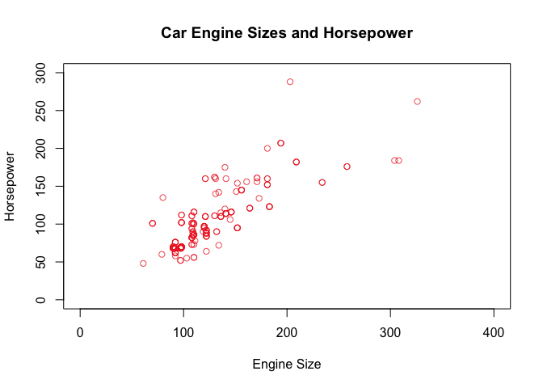<!-- --> The
relationship between these two variables is linear and positive—as the
engine size increases, so does the horsepower—and the points are grouped
relatively close together.

We can also calculate the correlation coefficient (*r*) to see exactly
how strong this association is:

``` r
cor(cars$enginesize, cars$horsepower)
```

    ## [1] 0.8097687

Not surprisingly, the association between engine size and horsepower is
very strong, at approximately 81%.

We can view the scatterplots of all variables (quantitative, continuous
ones, that is) by using the `pairs()` function.

``` r
pairs(cars[,c(10:14,17,19:26)]) # Using only quantitative/continuous variables
```

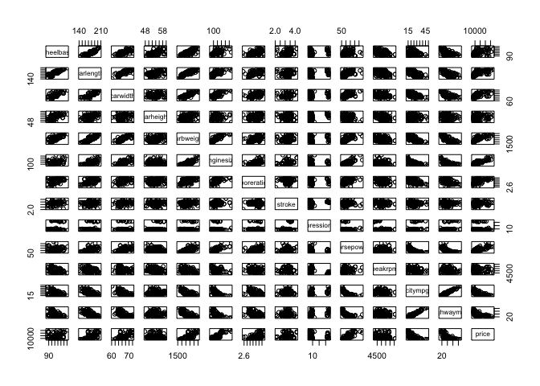<!-- -->

The sheer number of plots might appear overwhelming, but a closer look
reveals that certain factors, such as the car’s wheel base and its
length, are strongly associated. We can also view plots of each
variable’s association with price specifically.

``` r
cars_long <- gather(cars[,c(10:13,17,19:22, 24:26)], key, value, -price)
# cars_long
ggplot(cars_long, aes(x = price, y = value)) + geom_point() + facet_grid(. ~ key)
```

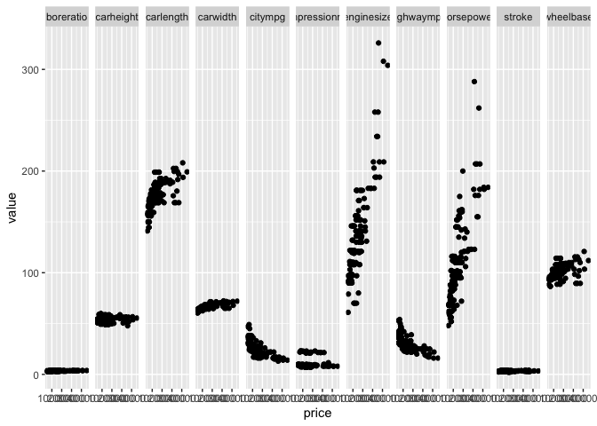<!-- -->

It appears from these plots that `enginesize` and `horsepower` might
have a strong positive relationship with `price`, whereas `citympg` and
`highwaympg` are negatively correlated with `price`. We can also see the
respective correlation coefficients of all variables and price using the
`correlate` function from the `corrr` package.

``` r
cor_tib <- correlate(cars[,c(10:14,17,19:26)])
```

    ## 
    ## Correlation method: 'pearson'
    ## Missing treated using: 'pairwise.complete.obs'

``` r
cor_tib_price <- data.frame(matrix(data = c(cor_tib$term, cor_tib$price), nrow = length(cor_tib$term), ncol = 2))
colnames(cor_tib_price) <- c("Variable", "r")
cor_tib_price <- cor_tib_price[-(nrow(cor_tib_price)),]
cor_tib_price$r <- round(as.numeric(cor_tib_price$r), 6)
cor_tib_price <- cor_tib_price %>% arrange(desc(r))
kable(cor_tib_price)
```

| Variable         |         r |
|:-----------------|----------:|
| enginesize       |  0.874145 |
| curbweight       |  0.835305 |
| horsepower       |  0.808139 |
| carwidth         |  0.759325 |
| carlength        |  0.682920 |
| wheelbase        |  0.577816 |
| boreratio        |  0.553173 |
| carheight        |  0.119336 |
| stroke           |  0.079443 |
| compressionratio |  0.067984 |
| peakrpm          | -0.085267 |
| citympg          | -0.685751 |
| highwaympg       | -0.697599 |

From these values, it is clear that `enginesize` and `horsepower`—along
with `curbweight` and `carwidth`—are indeed positively correlated with
`price`, and the two variables relating to miles per gallon are
strongly, yet negatively correlated with price.

``` r
plot(cars$curbweight, cars$price, col = alpha("firebrick2", 0.75), 
     ylim = c(0, 60000), xlim = c(1000, 5000), cex.axis = 0.7,
     xlab = "Curb Weight", ylab = "Price", main = "Car Curb Weights and Price")
```

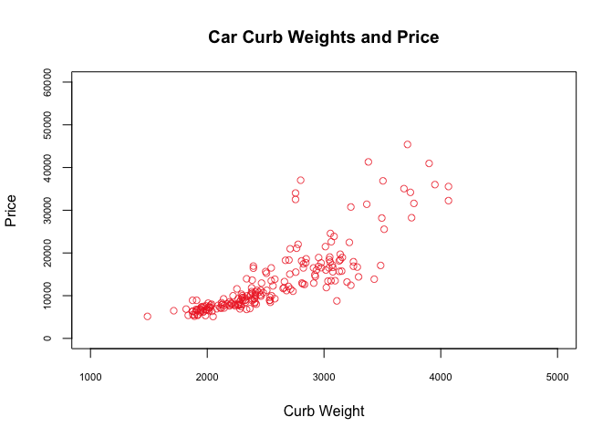<!-- -->

``` r
plot(cars$highwaympg, cars$price, col = alpha("firebrick2", 0.75), 
     ylim = c(0, 60000), xlim = c(10, 60), cex.axis = 0.7,
     xlab = "MPG (Highway)", ylab = "Price", main = "Car MPG (Highway) and Price")
```

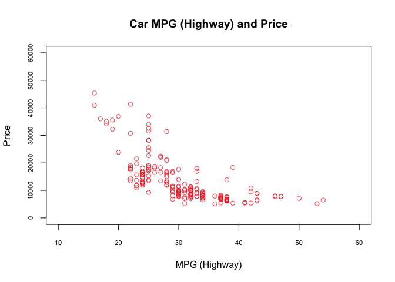<!-- -->

## Simple Linear Regression

Let us investigate exactly how much a particular variable can affect the
price of a car, which can be determined using simple linear regression
(SLR). In SLR, we designate one variable as the explanatory variable and
another as the response variable; simply put, the former explains the
change in the latter. We can, for instance, select the width of a car as
the explanatory variable, and the price of the car as the response
variable.

``` r
smod1 <- lm(cars$price ~ cars$carwidth)
smod1
```

    ## 
    ## Call:
    ## lm(formula = cars$price ~ cars$carwidth)
    ## 
    ## Coefficients:
    ##   (Intercept)  cars$carwidth  
    ##       -173095           2828

``` r
plot(cars$carwidth, cars$price, col = alpha("firebrick2", 0.75), 
     ylim = c(0, 60000), xlim = c(60, 75), cex.axis = 0.7,
     xlab = "Car Width", ylab = "Price", main = "Car Widths and Price")
abline(smod1,col="goldenrod2")
```

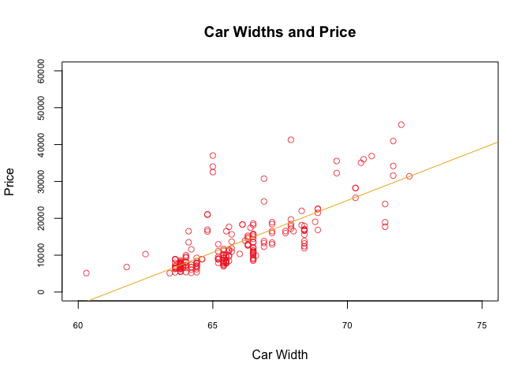<!-- -->

As shown in the plot, the regression line fits the data reasonably well,
with a good portion of the points falling around the line. Even so,
there are several points that are further away from the line than the
main grouping.

The least-squares regression equation for the model is *ŷ* = -173095.2 +
2827.767*x*. Although the intercept *β̂*<sub>0</sub> = -173,095.2 has no
practical meaning in this context, *β̂*<sub>1</sub> can be interpreted as
predicting that, for each additional inch in a car’s width (although the
dataset’s creator did not specify the units used for car dimensions,
inches is the only one that makes sense), the price of the car increases
by approximately $2,827.767.

If we wanted to test whether *β*<sub>1</sub> = 0, we could use an
analysis of variance (ANOVA) table to calculate the appropriate test
statistic for the hypothesis test, which can be conducted in five steps:

Step 1) *H*<sub>0</sub>: *β*<sub>1</sub> = 0, *H*<sub>1</sub>:
*β*<sub>1</sub> ≠ 0, *a* = 0.05

Step 2) For this test, I selected the *F* statistic, which is *F* =
$\\frac{Mean Sum of Squares (Regression)}{Mean Sum of Squares (Residual)}$
with 1 and *n* - 2 degrees of freedom.

``` r
# Calculate the critical value
CV <- qt(1-0.05/2, df=nrow(cars)-2)
CV
```

    ## [1] 1.971719

Step 3) The *F*-distribution critical value is *F*<sub>1,n-2,a</sub> =
*F*<sub>1,203,0.05</sub> = 1.972. Therefore, *H*<sub>0</sub> must be
rejected if *F* ≥ 1.972. Otherwise, there is not sufficient evidence to
reject the null hypothesis.

Step 4) See the calculations below.

``` r
# ANOVA table
kable(anova(smod1))
```

|               |  Df |     Sum Sq |    Mean Sq |  F value | Pr(&gt;F) |
|:--------------|----:|-----------:|-----------:|---------:|----------:|
| cars$carwidth |   1 | 7506797404 | 7506797404 | 276.4236 |         0 |
| Residuals     | 203 | 5512841958 |   27156857 |       NA |        NA |

``` r
# Calculate the F statistic
F <- anova(smod1)[1,3]/anova(smod1)[2,3]
F
```

    ## [1] 276.4236

``` r
# Sanity check
# anova(smod1)[1,4]
# summary(smod1)
```

Step 5) Because *F* = 276.4236459 &gt; 1.972, there is sufficient
evidence to reject the null hypothesis and conclude that *β*<sub>1</sub>
is not equal to 0. That is, there is a significant linear association.

Furthermore, one can calculate *R*<sup>2</sup>, the estimate of the
variability of the response variable given a value of the explanatory
variable.

``` r
# ANOVA table again for reference
kable(anova(smod1))
```

|               |  Df |     Sum Sq |    Mean Sq |  F value | Pr(&gt;F) |
|:--------------|----:|-----------:|-----------:|---------:|----------:|
| cars$carwidth |   1 | 7506797404 | 7506797404 | 276.4236 |         0 |
| Residuals     | 203 | 5512841958 |   27156857 |       NA |        NA |

``` r
# Calculate regression sum of squares, residual sum of squares, and total sum of squares
reg_SS <- anova(smod1)[1,2]
res_SS <- anova(smod1)[2,2]
total_SS <- reg_SS + res_SS

# Calculate R^2
r2 <- reg_SS / total_SS
r2
```

    ## [1] 0.5765749

According to the above calculations, *R*<sup>2</sup> is 0.5765749. This
means that 57.66% of the variability in the price of a car can be
explained by the car’s width.

Finally, one can determine the confidence interval for *β*<sub>1</sub>
with a confidence level of 90%.

``` r
confint(smod1, level = 0.9)
```

    ##                       5 %        95 %
    ## (Intercept)   -191627.800 -154562.674
    ## cars$carwidth    2546.726    3108.809

Using `confint()`, one can observe that the confidence interval for
*β*<sub>1</sub> at a level of 90% is 2546.726 and 3108.809. Therefore,
we can be confident that the true value for the slope of the
least-squares regression line—the amount by which a car’s price
increases with each additional inch in width—lies within that range
approximately 90% of the time if we conducted 100 different random
samples. In other words, we can be 90% confident that the true value for
*β*<sub>1</sub> is contained in that interval. As it turns out, the
value calculated earlier for *β*<sub>1</sub> (2827.767) falls within in
the range. Moreover, it would make sense that wider (bigger) cars might
cost more than smaller ones.

What if we wanted to know the influence that the number of miles per
gallon (MPG) in the city has on the car’s price?

Let us first look at a scatterplot of MPG in the city against car price.

``` r
plot(cars$citympg, cars$price, col = alpha("firebrick2", 0.75), 
     ylim = c(0, 60000), xlim = c(10, 60), cex.axis = 0.7,
     xlab = "MPG (City)", ylab = "Price", main = "Car MPG (City) and Price")
```

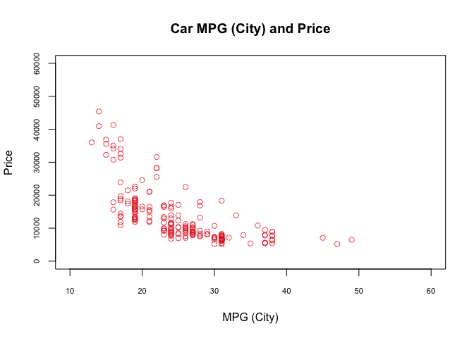<!-- -->

As determined by the initial correlation coefficient that we calculated
(-0.69), the association between these two variables is moderately
strong and negative, meaning that as the MPG in the city increases, the
price tends to decrease. To some, the plot might also appear to be
roughly linear, especially if the three points just to the left of *x* =
50 were removed. However, we should first consult a residual plot, which
visualizes the distances between the actual and predicted values of the
response variable (price) for a given value of the explanatory variable
(city MPG).

``` r
smod2 <- lm(cars$price ~ cars$citympg)

plot(x = smod2$fitted.values, y = smod2$residuals, main = "Residuals vs. Fitted Values", 
     xlab = "Fitted Values", ylab = "Residuals", col=alpha("firebrick2", 0.75),
     xlim = c(-10000, 25000), ylim = c(-15000, 25000))
abline(h = 0,col="goldenrod2")
```

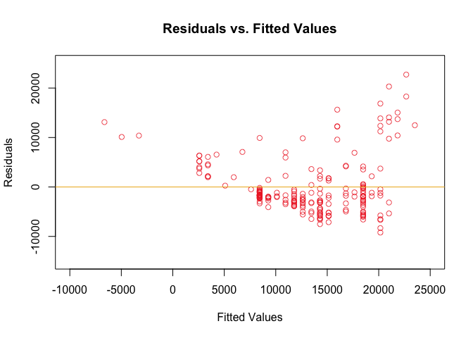<!-- -->

From this plot, it is clear that not only is the data nonlinear, but
also that the variability in the response is not constant across the
regression line. In fact, the data fans out as *x* increases. Therefore,
removing the supposed outlying points from the scatterplot would make no
difference, because the data clearly violates a key assumption of linear
regression—that the variability remains relatively constant.

Returning to the previous example, the relationship between car width
and price, we can view the corresponding residual plot:

``` r
plot(x = smod1$fitted.values, y = smod1$residuals, main = "Residuals vs. Fitted Values", 
     xlab = "Fitted Values", ylab = "Residuals", col=alpha("firebrick2", 0.75),
     xlim = c(-5000, 35000), ylim = c(-20000, 30000))
abline(h = 0,col="goldenrod2")
```

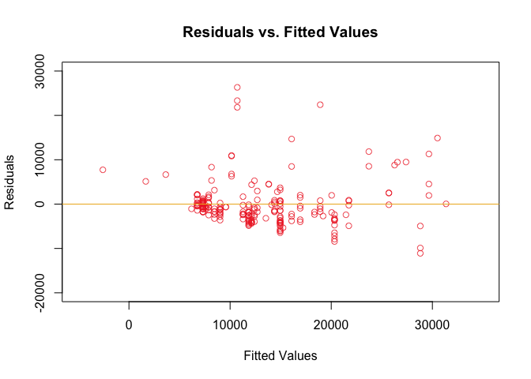<!-- -->

Obviously, there are quite a few stray points, but they generally flow
straight across the regression line.

``` r
hist(x = smod1$residuals, main = "Residuals", xlab = "Residuals",
     col = "firebrick2", xlim = c(-20000, 40000), ylim = c(0, 150))
```

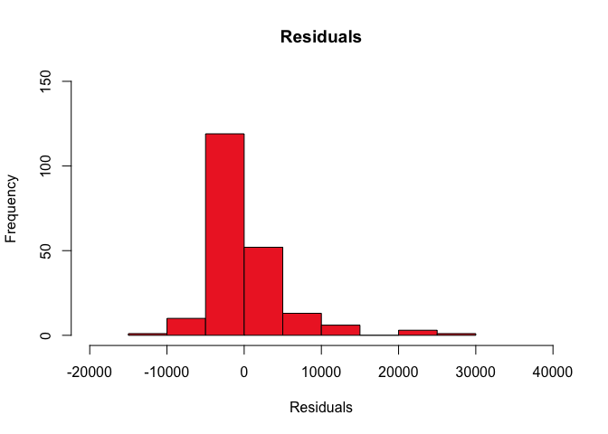<!-- -->

The distribution of the residuals is roughly bell-shaped, but there is a
tail to the right, which might suggest the presence of outliers.

``` r
plot(smod1, which = 1)
```

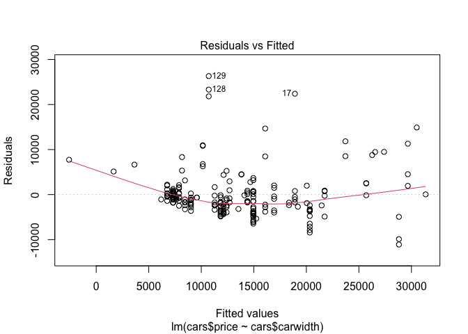<!-- -->

This plot has identified observations 17, 128, 129—the BMW X5, Porsche
Cayenne, and Porsche Boxter, respectively—as outliers, and observation
127 (Porsche Panamera) also appears to be an outlier. If we removed one,
two, three, or all of those points we would obtain the following model
results:

``` r
# Original model
smod1
```

    ## 
    ## Call:
    ## lm(formula = cars$price ~ cars$carwidth)
    ## 
    ## Coefficients:
    ##   (Intercept)  cars$carwidth  
    ##       -173095           2828

``` r
# Row 17 removed
cars2 <- cars[-(c(17)),]
smod1a <- lm(cars2$price ~ cars2$carwidth)
smod1a
```

    ## 
    ## Call:
    ## lm(formula = cars2$price ~ cars2$carwidth)
    ## 
    ## Coefficients:
    ##    (Intercept)  cars2$carwidth  
    ##        -170043            2780

``` r
#summary(smod1a)

# Row 127 removed
cars3 <- cars[-(c(127)),]
smod1b <- lm(cars3$price ~ cars3$carwidth)
smod1b
```

    ## 
    ## Call:
    ## lm(formula = cars3$price ~ cars3$carwidth)
    ## 
    ## Coefficients:
    ##    (Intercept)  cars3$carwidth  
    ##        -174601            2849

``` r
#summary(smod1b)

# Row 128 removed
cars4 <- cars[-(c(128)),]
smod1c <- lm(cars4$price ~ cars4$carwidth)
smod1c
```

    ## 
    ## Call:
    ## lm(formula = cars4$price ~ cars4$carwidth)
    ## 
    ## Coefficients:
    ##    (Intercept)  cars4$carwidth  
    ##        -174704            2850

``` r
#summary(smod1c)

# Row 129 removed
cars5 <- cars[-(c(129)),]
smod1d <- lm(cars5$price ~ cars5$carwidth)
smod1d
```

    ## 
    ## Call:
    ## lm(formula = cars5$price ~ cars5$carwidth)
    ## 
    ## Coefficients:
    ##    (Intercept)  cars5$carwidth  
    ##        -174911            2853

``` r
#summary(smod1d)

# Both rows 17 and 127 removed
cars6 <- cars[-(c(17, 127)),]
smod1e <- lm(cars6$price ~ cars6$carwidth)
smod1e
```

    ## 
    ## Call:
    ## lm(formula = cars6$price ~ cars6$carwidth)
    ## 
    ## Coefficients:
    ##    (Intercept)  cars6$carwidth  
    ##        -171545            2801

``` r
#summary(smod1e)

# Both rows 17 and 128 removed
cars7 <- cars[-(c(17, 128)),]
smod1f <- lm(cars7$price ~ cars7$carwidth)
smod1f
```

    ## 
    ## Call:
    ## lm(formula = cars7$price ~ cars7$carwidth)
    ## 
    ## Coefficients:
    ##    (Intercept)  cars7$carwidth  
    ##        -171647            2802

``` r
#summary(smod1f)

# Both rows 17 and 129 removed
cars8 <- cars[-(c(17, 129)),]
smod1g <- lm(cars8$price ~ cars8$carwidth)
smod1g
```

    ## 
    ## Call:
    ## lm(formula = cars8$price ~ cars8$carwidth)
    ## 
    ## Coefficients:
    ##    (Intercept)  cars8$carwidth  
    ##        -171853            2805

``` r
#summary(smod1g)

# Both rows 127 and 128 removed
cars9 <- cars[-(c(127, 128)),]
smod1h <- lm(cars9$price ~ cars9$carwidth)
smod1h
```

    ## 
    ## Call:
    ## lm(formula = cars9$price ~ cars9$carwidth)
    ## 
    ## Coefficients:
    ##    (Intercept)  cars9$carwidth  
    ##        -176228            2872

``` r
#summary(smod1h)

# Both rows 127 and 129 removed
cars10 <- cars[-(c(127, 129)),]
smod1i <- lm(cars10$price ~ cars10$carwidth)
smod1i
```

    ## 
    ## Call:
    ## lm(formula = cars10$price ~ cars10$carwidth)
    ## 
    ## Coefficients:
    ##     (Intercept)  cars10$carwidth  
    ##         -176436             2875

``` r
#summary(smod1i)

# Both rows 128 and 129 removed
cars11 <- cars[-(c(128, 129)),]
smod1j <- lm(cars11$price ~ cars11$carwidth)
smod1j
```

    ## 
    ## Call:
    ## lm(formula = cars11$price ~ cars11$carwidth)
    ## 
    ## Coefficients:
    ##     (Intercept)  cars11$carwidth  
    ##         -176541             2876

``` r
#summary(smod1j)

# Rows 17, 127, and 128 removed
cars12 <- cars[-(c(17, 127, 128)),]
smod1k <- lm(cars12$price ~ cars12$carwidth)
smod1k
```

    ## 
    ## Call:
    ## lm(formula = cars12$price ~ cars12$carwidth)
    ## 
    ## Coefficients:
    ##     (Intercept)  cars12$carwidth  
    ##         -173167             2824

``` r
#summary(smod1k)

# Rows 17, 127, and 129 removed
cars13 <- cars[-(c(17, 127, 129)),]
smod1l <- lm(cars13$price ~ cars13$carwidth)
smod1l
```

    ## 
    ## Call:
    ## lm(formula = cars13$price ~ cars13$carwidth)
    ## 
    ## Coefficients:
    ##     (Intercept)  cars13$carwidth  
    ##         -173374             2827

``` r
#summary(smod1l)

# Rows 17, 128, and 129 removed
cars14 <- cars[-(c(17, 128, 129)),]
smod1m <- lm(cars14$price ~ cars14$carwidth)
smod1m
```

    ## 
    ## Call:
    ## lm(formula = cars14$price ~ cars14$carwidth)
    ## 
    ## Coefficients:
    ##     (Intercept)  cars14$carwidth  
    ##         -173477             2828

``` r
#summary(smod1m)

# Rows 127, 128, and 129 removed
cars15 <- cars[-(c(127, 128, 129)),]
smod1n <- lm(cars15$price ~ cars15$carwidth)
smod1n
```

    ## 
    ## Call:
    ## lm(formula = cars15$price ~ cars15$carwidth)
    ## 
    ## Coefficients:
    ##     (Intercept)  cars15$carwidth  
    ##         -178084             2898

``` r
#summary(smod1n)

# All outliers removed
cars16 <- cars[-(c(17, 127, 128, 129)),]
smod1o <- lm(cars16$price ~ cars16$carwidth)
smod1o
```

    ## 
    ## Call:
    ## lm(formula = cars16$price ~ cars16$carwidth)
    ## 
    ## Coefficients:
    ##     (Intercept)  cars16$carwidth  
    ##         -175017             2850

``` r
#summary(smod1o)
```

Of these models, the one that removes observations 17, 128, and 129
(model `smod1m`) performs the best in terms of matching the original
*β*<sub>1</sub> estimate of 2827.767. That being said, since none of the
points seems to be an influence point (that is, a point that has a
significant impact on the regression line calculations), the model that
removes all identified outliers (`smod1o`) would be preferred.

``` r
plot(cars16$carwidth, cars16$price, col = alpha("firebrick2", 0.75), 
     ylim = c(0, 60000), xlim = c(60, 75), cex.axis = 0.7,
     xlab = "Car Width", ylab = "Price", main = "Car Widths and Price")
abline(smod1o,col="goldenrod2")
```

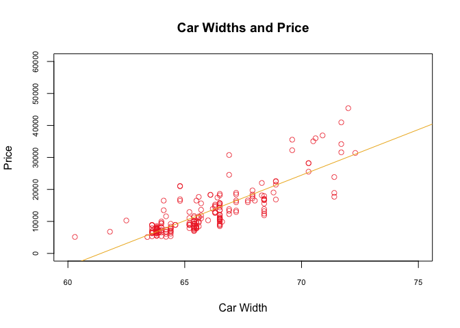<!-- -->

``` r
plot(x = smod1o$fitted.values, y = smod1o$residuals, main = "Residuals vs. Fitted Values", 
     xlab = "Fitted Values", ylab = "Residuals", col=alpha("firebrick2", 0.75),
     xlim = c(-5000, 35000), ylim = c(-20000, 30000))
abline(h = 0,col="goldenrod2")
```

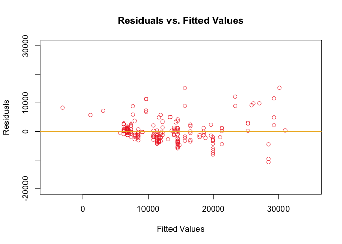<!-- -->

``` r
hist(x = smod1o$residuals, main = "Residuals (Outliers Removed)", xlab = "Residuals",
     col = "firebrick2", xlim = c(-20000, 30000), ylim = c(0, 150))
```

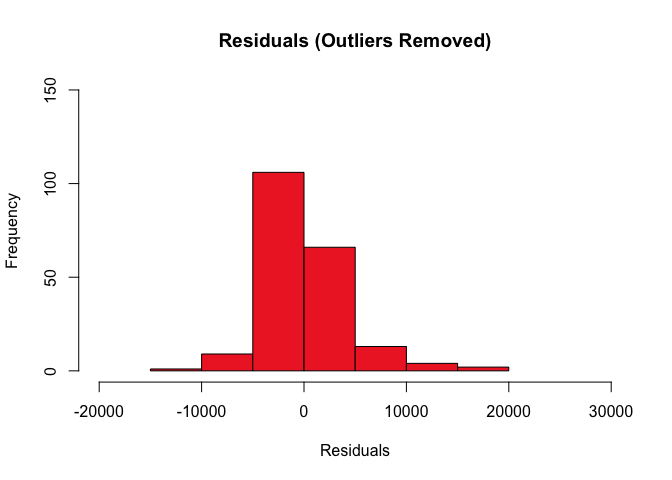<!-- -->

Not only does the new model remove the outliers, but the tail in the
histogram has also been eliminated, resulting in a more normal-looking
distribution.

## Multiple Linear Regression

Having performed a regression with a single explanatory variable, we can
also create a model with multiple factors, such as the car’s engine
size, width, peak revolutions per minute (RPM), and bore ratio.

``` r
mmod1 <- lm(cars$price ~ cars$enginesize + cars$carwidth + cars$peakrpm + cars$boreratio)
mmod1
```

    ## 
    ## Call:
    ## lm(formula = cars$price ~ cars$enginesize + cars$carwidth + cars$peakrpm + 
    ##     cars$boreratio)
    ## 
    ## Coefficients:
    ##     (Intercept)  cars$enginesize    cars$carwidth     cars$peakrpm  
    ##      -83547.018          134.263          951.279            2.555  
    ##  cars$boreratio  
    ##        1199.794

``` r
#summary(mmod1)
```

Hence, the least-squares regression equation would be: *ŷ* = -83547.018
+ 134.263*x*<sub>EngineSize</sub> + 951.279*x*<sub>Width</sub> +
2.555*x*<sub>PeakRPM</sub> − 1199.794*x*<sub>BoreRatio</sub>.

We can test whether these factors are truly associated with a car’s
price, using the *F*-test.

Step 1) *H*<sub>0</sub>: *β*<sub>EngineSize</sub> = *β*<sub>Width</sub>
= *β*<sub>PeakRPM</sub> = *β*<sub>BoreRatio</sub> = 0, *H*<sub>1</sub>:
*β*<sub>EngineSize</sub> ≠ 0 and/or *β*<sub>Width</sub> ≠ 0 and/or
*β*<sub>PeakRPM</sub> ≠ 0 and/or *β*<sub>BoreRatio</sub> ≠ 0, *a* = 0.05

Step 2) For this (global) test, I decided to use the *F*-statistic,
which is *F* =
$\\frac{Mean Sum of Squares (Regression)}{Mean Sum of Squares (Residual)}$
with 4 and *n* − 4 − 1 = 205$ - 4 - 1$ = 200 degrees of freedom.

Step 3) If *p* ≤ *α*, then the null hypothesis, *H*<sub>0</sub>, must be
rejected. If not, then *H*<sub>0</sub> cannot be rejected.

Step 4) The values for the *F*-statistic and *p*-value can be calculated
by calling the `summary()` function.

``` r
summary(mmod1)
```

    ## 
    ## Call:
    ## lm(formula = cars$price ~ cars$enginesize + cars$carwidth + cars$peakrpm + 
    ##     cars$boreratio)
    ## 
    ## Residuals:
    ##     Min      1Q  Median      3Q     Max 
    ## -8403.6 -2084.6  -150.4  1655.6 14070.7 
    ## 
    ## Coefficients:
    ##                   Estimate Std. Error t value Pr(>|t|)    
    ## (Intercept)     -8.355e+04  1.089e+04  -7.672 7.28e-13 ***
    ## cars$enginesize  1.343e+02  9.072e+00  14.800  < 2e-16 ***
    ## cars$carwidth    9.513e+02  1.720e+02   5.532 9.86e-08 ***
    ## cars$peakrpm     2.555e+00  5.306e-01   4.814 2.91e-06 ***
    ## cars$boreratio   1.200e+03  1.146e+03   1.047    0.297    
    ## ---
    ## Signif. codes:  0 '***' 0.001 '**' 0.01 '*' 0.05 '.' 0.1 ' ' 1
    ## 
    ## Residual standard error: 3468 on 200 degrees of freedom
    ## Multiple R-squared:  0.8152, Adjusted R-squared:  0.8115 
    ## F-statistic: 220.6 on 4 and 200 DF,  p-value: < 2.2e-16

Step 5) The *F*-statistic is 220.6, and the *p*-value is less than 2.2
\* 10<sup>-16</sup>. Because *p* &lt; *α*, there is sufficient evidence
at the *α* = 0.05 level to reject *H*<sub>0</sub>, meaning that there is
a significant linear association between a car’s price and—taken all
together—its engine size, width, peak RPM, and bore ratio.

Now, having determined that the overall model is significant, we can see
if the individual predictors are also significant: Engine size has a
*p*-value of less than 2.2 \* 10<sup>-16</sup>, width a *p*-value of
0.0000000986, peak RPM a *p*-value of 0.00000291, and bore ratio a
*p*-value of 0.297. That is, engine size is significant given width,
peak RPM, and bore ratio, and width is significant when controlling for
engine size, peak RPM, and bore ratio. Peak RPM is also significant,
adjusting for engine size, width, and bore ratio. Bore ratio, however,
is not significant, since its *p*-value is greater than the confidence
level (0.05).

``` r
confint(mmod1)
```

    ##                         2.5 %        97.5 %
    ## (Intercept)     -1.050211e+05 -62072.943267
    ## cars$enginesize  1.163741e+02    152.150949
    ## cars$carwidth    6.121684e+02   1290.389184
    ## cars$peakrpm     1.508312e+00      3.601074
    ## cars$boreratio  -1.060651e+03   3460.238718

The three significant variables—engine size, width, and peak RPM—all
fall within the respective 95% confidence intervals, meaning that we can
be 95% confident that the true value for each variable lies within its
particular range, after controlling for the other variables.

Therefore, one can draw a few conclusions from the model: For each
1-unit increase in engine size (I could not determine which unit of
measure was used)—adjusting for width, peak RPM, and bore ratio—the
price of the car increases by $134.26. For each one-inch increase in
width—controlling for engine size, peak RPM, and bore ratio—the price
increases by $951.28. Lastly, for each one-revolution-per-minute
increase in peak RPM—taking the other factors into account—the price
increases by only $2.56.

``` r
plot(x = mmod1$fitted.values, y = mmod1$residuals, main = "Residuals vs. Fitted Values", 
     xlab = "Fitted Values", ylab = "Residuals", col=alpha("firebrick2", 0.75),
     xlim = c(-10000, 50000), ylim = c(-10000, 20000))
abline(h = 0,col="goldenrod2")
```

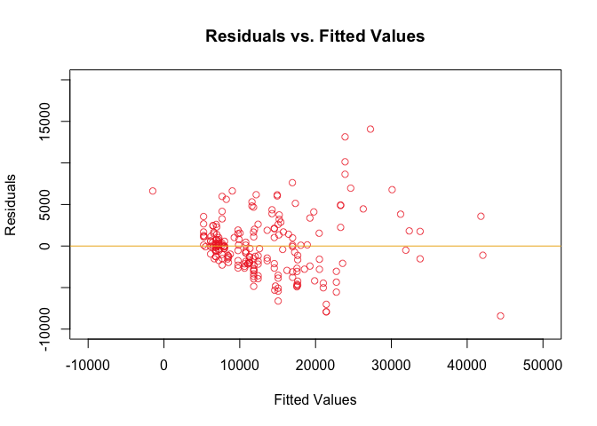<!-- -->

Upon viewing a residual plot of this multiple linear regression model,
the form is not very linear, but that can possibly be resolved by
removing outliers.

``` r
MLR_box <- boxplot(x = mmod1$residuals, main = "Residuals", ylab = "Residuals", col=c("red"),
        horizontal=TRUE, ylim = c(-10000, 20000))
```

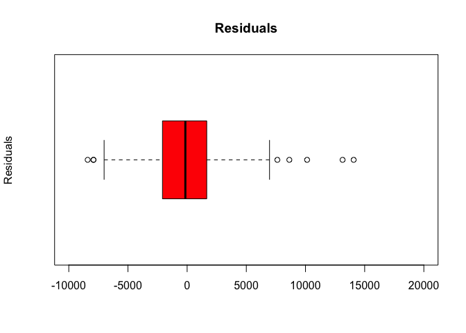<!-- -->

``` r
MLR_box
```

    ## $stats
    ##            [,1]
    ## [1,] -7015.2366
    ## [2,] -2084.5823
    ## [3,]  -150.3955
    ## [4,]  1655.5787
    ## [5,]  6962.1084
    ## 
    ## $n
    ## [1] 205
    ## 
    ## $conf
    ##           [,1]
    ## [1,] -563.1297
    ## [2,]  262.3387
    ## 
    ## $out
    ##        15        17        50       102       104       127       128       129 
    ##  7623.648 14070.723 -8403.586 -7915.237 -7915.237  8635.047 10135.047 13135.047 
    ## 
    ## $group
    ## [1] 1 1 1 1 1 1 1 1
    ## 
    ## $names
    ## [1] ""

A boxplot of the residuals has identified several outliers:

``` r
MLR_box$out
```

    ##        15        17        50       102       104       127       128       129 
    ##  7623.648 14070.723 -8403.586 -7915.237 -7915.237  8635.047 10135.047 13135.047

Those points correspond to the BMW Z4, BMW X5, Jaguar XK, Nissan Dayz,
Nissan Otti, Porsche Panamera, Porsche Cayenne, and Porsche Boxter,
respectively.

Since we have already identified and removed some of these points in
previous models, let us see how much a model with all of them removed
compares with the original MLR model.

``` r
# Original model
mmod1 <- lm(cars$price ~ cars$enginesize + cars$carwidth + cars$peakrpm + cars$boreratio)
mmod1
```

    ## 
    ## Call:
    ## lm(formula = cars$price ~ cars$enginesize + cars$carwidth + cars$peakrpm + 
    ##     cars$boreratio)
    ## 
    ## Coefficients:
    ##     (Intercept)  cars$enginesize    cars$carwidth     cars$peakrpm  
    ##      -83547.018          134.263          951.279            2.555  
    ##  cars$boreratio  
    ##        1199.794

``` r
# All outliers removed
cars17 <- cars[-(c(15, 17, 50, 102, 104, 127, 128, 129)),]
mmod1a <- lm(cars17$price ~ cars17$enginesize + cars17$carwidth + cars17$peakrpm + cars17$boreratio)
mmod1a
```

    ## 
    ## Call:
    ## lm(formula = cars17$price ~ cars17$enginesize + cars17$carwidth + 
    ##     cars17$peakrpm + cars17$boreratio)
    ## 
    ## Coefficients:
    ##       (Intercept)  cars17$enginesize    cars17$carwidth     cars17$peakrpm  
    ##        -93195.776            119.919           1278.831              1.689  
    ##  cars17$boreratio  
    ##          -569.589

``` r
summary(mmod1)
```

    ## 
    ## Call:
    ## lm(formula = cars$price ~ cars$enginesize + cars$carwidth + cars$peakrpm + 
    ##     cars$boreratio)
    ## 
    ## Residuals:
    ##     Min      1Q  Median      3Q     Max 
    ## -8403.6 -2084.6  -150.4  1655.6 14070.7 
    ## 
    ## Coefficients:
    ##                   Estimate Std. Error t value Pr(>|t|)    
    ## (Intercept)     -8.355e+04  1.089e+04  -7.672 7.28e-13 ***
    ## cars$enginesize  1.343e+02  9.072e+00  14.800  < 2e-16 ***
    ## cars$carwidth    9.513e+02  1.720e+02   5.532 9.86e-08 ***
    ## cars$peakrpm     2.555e+00  5.306e-01   4.814 2.91e-06 ***
    ## cars$boreratio   1.200e+03  1.146e+03   1.047    0.297    
    ## ---
    ## Signif. codes:  0 '***' 0.001 '**' 0.01 '*' 0.05 '.' 0.1 ' ' 1
    ## 
    ## Residual standard error: 3468 on 200 degrees of freedom
    ## Multiple R-squared:  0.8152, Adjusted R-squared:  0.8115 
    ## F-statistic: 220.6 on 4 and 200 DF,  p-value: < 2.2e-16

``` r
summary(mmod1a)
```

    ## 
    ## Call:
    ## lm(formula = cars17$price ~ cars17$enginesize + cars17$carwidth + 
    ##     cars17$peakrpm + cars17$boreratio)
    ## 
    ## Residuals:
    ##     Min      1Q  Median      3Q     Max 
    ## -5981.7 -1835.5  -165.2  1416.4  7285.1 
    ## 
    ## Coefficients:
    ##                     Estimate Std. Error t value Pr(>|t|)    
    ## (Intercept)       -9.320e+04  9.159e+03 -10.176  < 2e-16 ***
    ## cars17$enginesize  1.199e+02  8.753e+00  13.701  < 2e-16 ***
    ## cars17$carwidth    1.279e+03  1.516e+02   8.438  7.7e-15 ***
    ## cars17$peakrpm     1.689e+00  4.578e-01   3.689 0.000293 ***
    ## cars17$boreratio  -5.696e+02  9.633e+02  -0.591 0.555024    
    ## ---
    ## Signif. codes:  0 '***' 0.001 '**' 0.01 '*' 0.05 '.' 0.1 ' ' 1
    ## 
    ## Residual standard error: 2819 on 192 degrees of freedom
    ## Multiple R-squared:  0.8496, Adjusted R-squared:  0.8465 
    ## F-statistic: 271.1 on 4 and 192 DF,  p-value: < 2.2e-16

For the most part, the calculated *β* intercepts did not change too
drastically in the new model—except for that of bore ratio, but as with
the original model, it was identified as a significant predictor of car
prices. The *R*<sup>2</sup> values are fairly similar, and the
*p*-values are the same.

``` r
plot(x = mmod1$fitted.values, y = mmod1$residuals, main = "Residuals vs. Fitted Values (Original)", 
     xlab = "Fitted Values", ylab = "Residuals", col=alpha("firebrick2", 0.75),
     xlim = c(-10000, 50000), ylim = c(-10000, 20000))
abline(h = 0,col="goldenrod2")
```

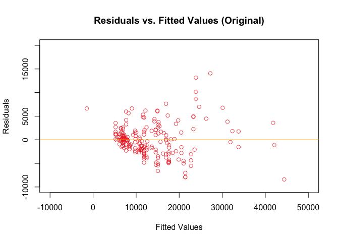<!-- -->

``` r
plot(x = mmod1a$fitted.values, y = mmod1a$residuals, main = "Residuals vs. Fitted Values (No Outliers)", 
     xlab = "Fitted Values", ylab = "Residuals", col=alpha("firebrick2", 0.75),
     xlim = c(-10000, 50000), ylim = c(-10000, 20000))
abline(h = 0,col="goldenrod2")
```

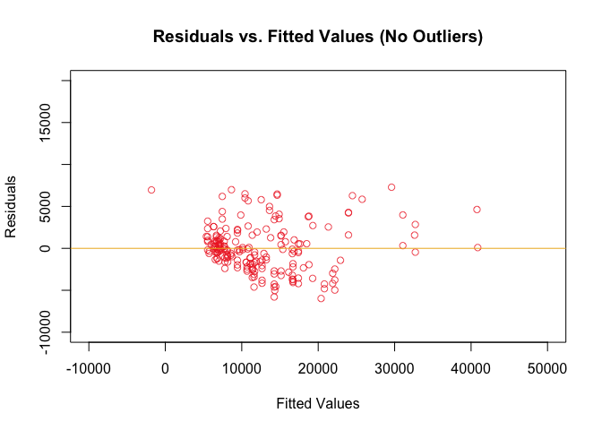<!-- --> The
above plots seem to show that removing the outliers did not alter the
spread of the residuals too much, and now the plot looks more linear in
form.

``` r
hist(x = mmod1$residuals, main = "Residuals", xlab = "Residuals",
     col = "firebrick2", xlim = c(-15000, 20000), ylim = c(0, 100))
```

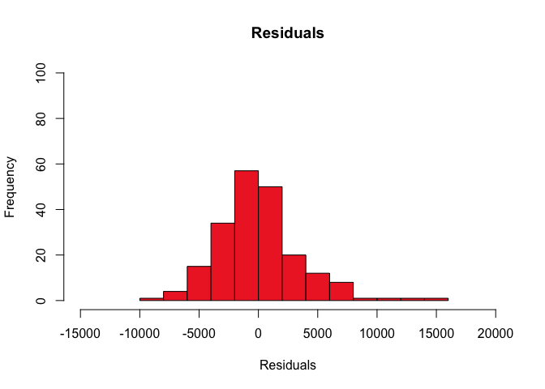<!-- -->

``` r
hist(x = mmod1a$residuals, main = "Residuals (No Outliers)", xlab = "Residuals",
     col = "firebrick2", xlim = c(-15000, 20000), ylim = c(0, 100))
```

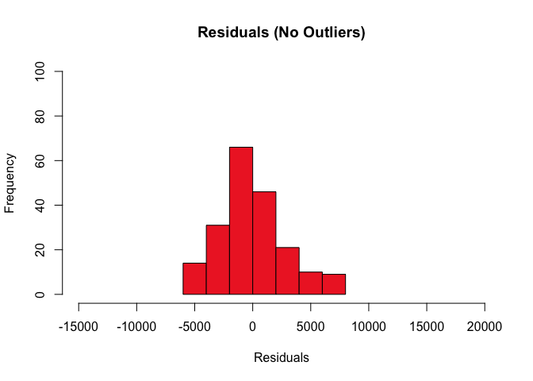<!-- -->

The tails of the residual distribution plot also disappeared after
removing the outliers.

## Conclusion

As the above statistical analyses demonstrate, various factors seem to
influence how a car is priced. The width of a car, for example, appears
to be a significant predictor of its price, and the SLR model that I
created (`smod1o`) indicates that, based upon the data, for each
additional inch of width, the price increases by approximately $2,850.
This does make some sense, in that larger cars can cost more. However,
there are many models of sports cars that are much smaller than, say, a
Ford F-150 truck, but are priced much higher. Consequently, there might
be extreme examples in the data that bias the calculations in favor of
larger vehicles, or it may simply be the case that the number of larger
cars outnumber the smaller, yet more expensive ones.

In the MLR model, I selected four variables—engine size, width, peak
RPM, and bore ratio, which had different correlation coefficients with
price—and determined how they affected the cost of a car. From the model
without outliers (`mmod1a`), it is clear that engine size, width, and
peak RPM are significant factors with regard to predicting a car’s
price. For each 1-unit increase in engine size—adjusting for width, peak
RPM, and bore ratio—the price of the car increases by about $120. For
each one-inch increase in width—controlling for engine size, peak RPM,
and bore ratio—the price increases by $1,1279. Lastly, for each
one-revolution-per-minute increase in peak RPM—taking the other factors
into account—the price increases by only $1.70. Apparently, then, the
width (or perhaps more generally, size) of a car has the greatest effect
on the price, at least out of the variables employed in the model.

Of course, simply because the models generated these results from the
data, one should be cautious in extrapolating such conclusions beyond
the cars in the dataset, or even just to other datasets. This is
because, among other reasons, I could not verify the exact
specifications used in the data—even the units of measure—nor the
specific year that a given car was manufactured, as designs of the same
model of car can vary relatively drastically over time. Furthermore, it
is doubtable that the width of the car is the single greatest predictor
of a car’s price; as with many other products in the world today, simply
the brand of a car can influence how it is priced. This would be another
avenue of analysis in the future, to determine whether categorical
variables such as the car’s manufacturer has a specific, quantifiable
effect on the price, which perhaps could be conducted using logistic
regression. Moreover, the distribution of individual variables such as
horsepower, when plotted against price, were nonlinear, and therefore
unusable in linear regression models. Perhaps this issue could be
resolved by transforming the data in some way. Finally, collinearity was
a danger throughout my analyses, since several variables, like a car’s
width and length, are very closely related. I realize that the size of
the engine might impact the bore ratio and peak RPM, for instance, but
those seemed to be the least problematic variables to use.

All in all, it is quite clear that just as there are many features and
components of a car, so too are there many factors that influence how
much a car costs.
